<!-- vim: set fdm=marker tw=80: -->

# Intro

A script that generates and executes gnuplot commands for plotting audio
spectrum.

The main motivation was to get something better looking than Audacity spectrum.
Fortunately Audacity provides the option to export spectrum data and that's what
the script is plotting.

The simplest invocation is:

    ]$ plot_spectrum -i spectrum.txt 2 foo

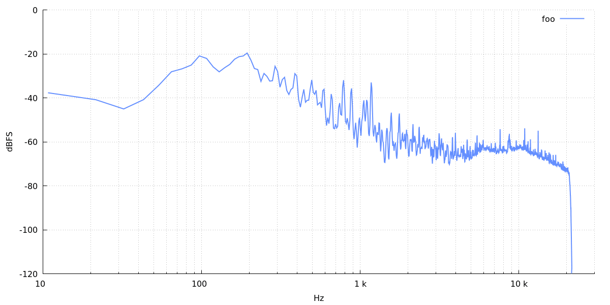

This produces "spectrum.png" file with a plot of data from "spectrum.txt" file.
The plot axes are labelled "Hz" and "dBFS" (the defaults) and the plot line is
labelled "foo".

The data exported by Audacity is in the following format:

    frequency_1 magnitude_in_db_1
    frequency_2 magnitude_in_db_2
    ...

The script can accept files with more sets of data:

    frequency_1 magnitude_A_in_db_1 magnitude_B_in_db_1 ...
    frequency_2 magnitude_A_in_db_2 magnitude_B_in_db_1 ...
    ...

The "2 foo" part of the invocation above simply says to use the second column and
label it "foo".

# Command line options

Here's the full help:

    ]$ plot_spectrum --help
    Usage: plot_spectrum -i DATA_FILE [optional options] COL_N TITLE_N [COL_N TITLE_N [...]]
    Required:
      -i | --input DATA_FILE    - input file
      COL_N                     - column of data from the file (starts from 2,
                                  the 1st column is the frequency)
      TITLE_N                   - title fot the column data

    Optional:
      -o | --output OUTPUT_FILE - output file (default is same as input with the
                                  extension changed to "png")
      -f | --force              - force overwrite output file
      --gp-commands             - don't invoke gnuplot, just print gnuplot
                                  commands to stdout

      -xl | --xlabel LABEL      - x axis label (default is Hz)
      -yl | --ylabel LABEL      - y axis label (default is dBFS)
      --title TITLE             - graph title
      --xrange RANGE            - x axis range in [low:high] format
                                  (default is [20:30000])
      --yrange RANGE            - y axis range in [low:high] format
                                  (default is [-120:0])
      -l | --linear             - use linear freq. scale (default is log scale)
      -c | --compact            - compact mode, i.e. labels inside the graph
      --with-points             - use "linespoints" format instead of "lines"
      --size SIZE               - size of the graph (default is medium)

      --to-db                   - plot 20 * log10( data/db_ref )
      --db-ref REFERENCE        - reference value for dB calculations (default is 1)
      -h | --help               - this help message

    SIZE can be either a keyword or an actual size in format WIDTHxHEIGHT. Possible
    keywords and corresponding sizes:
      small:        800x400
      medium:       1200x600
      large | big:  1600x800

## Defaults

* output: same as input with the extension replaced by "png"
* size: 1200x600 px
* x axis label: Hz
* y axis label: dBFS
* x axis range: 10 to 30k
* y axis range: -120 to 0

When `--linear` switch is used and `--xrange` is not specified then x axis range
changes to 0 to 23k.

# Examples

## Linear frequency scale

    ]$ plot_spectrum -i spectrum.txt --size small \
    -o spectrum.linear.png --linear 2 foo

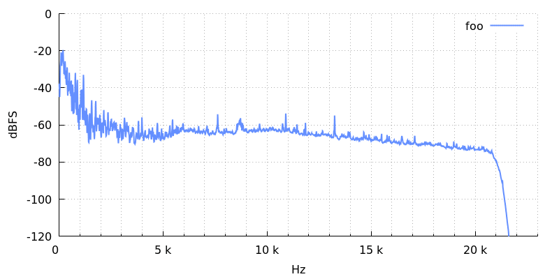

## Axes range

    ]$ plot_spectrum -i spectrum.hires.txt --size small \
    --linear --xrange "[10:50000]" 2 foo

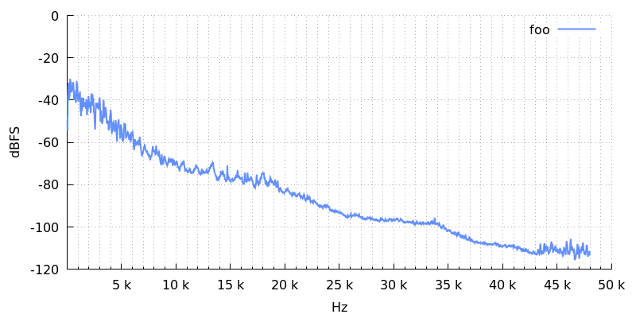

## Compact mode

A title and labels are normally positioned outside the graph area:

    ]$ plot_spectrum -i two_tones.txt --size small \
    -o compact_off.png --title foobar 2 foo

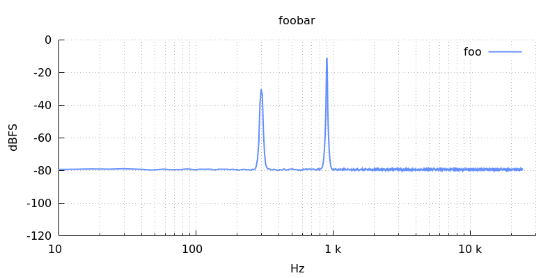

With compact mode they are moved into the graph area. With the same image size
the graph area gets bigger:

    ]$ plot_spectrum -i two_tones.txt --size small \
    -o compact_on.png --compact --title foobar 2 foo

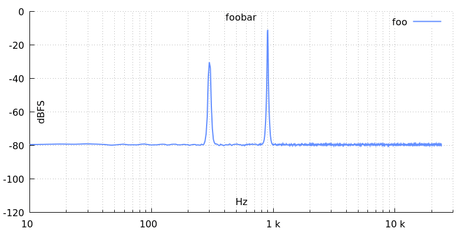

## Conversion to dBFS

If the FFT data is in absolute values:

    ]$ plot_spectrum -i absolute.txt --size small \
    --yrange "[0:1]" --ylabel "Level" 2 foo

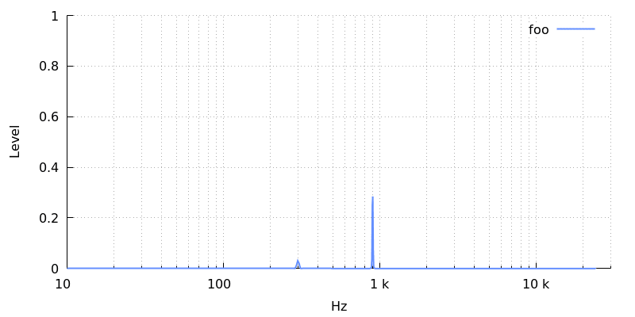

it can be converted for display to dBFS with `--to-db` switch:

    ]$ plot_spectrum -i absolute.txt --size small \
    -o absolute_to_db.png --to-db 2 foo

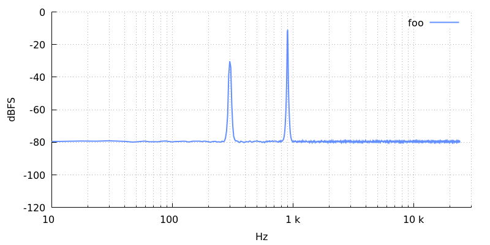

If required, the reference level (1 by default) can be changed too:

    ]$ plot_spectrum -i absolute.txt --size small \
    -o absolute_db_ref.png --to-db --db-ref 0.1 -yl dBSomething --yrange '[-100:20]' 2 foo

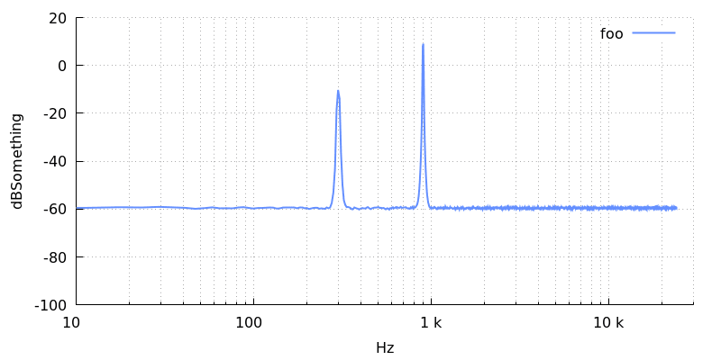

## Multiple signals

    ]$ plot_spectrum -i signals.txt --size small \
    --title '4096 FFT, Hann window' \
    2 signalA \
    3 signalB \
    4 signalC \
    5 signalD \
    6 signalE

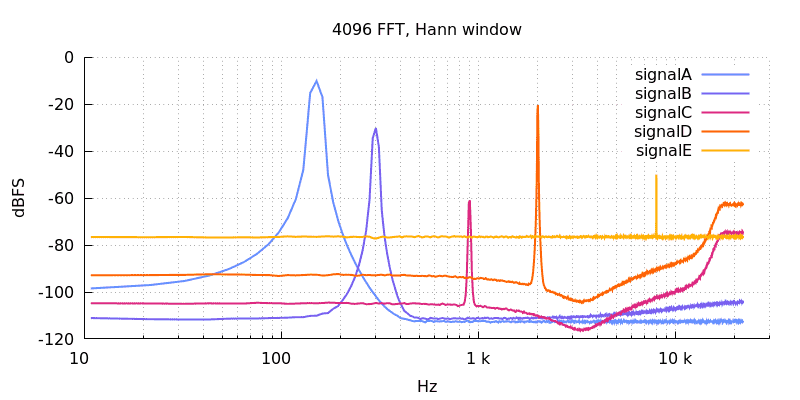

# Just gnuplot commands

It is possible to output just gnuplot commands, without calling gnuplot itself.
This allows to apply some custom modifications if necessary:

    ]$ plot_spectrum -i spectrum.txt --gp-commands 2 foo > out.gp
    ]$ cat out.gp
    reset
    set terminal pngcairo truecolor size 1200, 600
    set output "spectrum.png"
    ...
    ]$ gnuplot out.gp

# Special characters in the title and labels

Quoting is used to remove the special meaning of certain characters. See bash
manual, [QUOTING](https://man7.org/linux/man-pages/man1/bash.1.html#QUOTING)
section.

The texts in the generated gnuplot commands are double-quoted. In order to
display characters like `"`, `\` and `` ` ``, that characters need to be quoted
with `\`:

    set title "foo \" bar"
    set xlabel "foo \\ bar"
    set ylable "foo \` bar"

Because the shell that is used to call `plot_spectrum` (e.g. `bash`) does its
own quote removal, this has to be accounted for:

    ]$ plot_spectrum ... --title 'foo \" bar'
    ]$ plot_spectrum ... --title "foo \\\" bar"

## Quotes

`"` characters inside `'` still need to be quoted with `\` in order for gnuplot
to "see" them:

    ]$ plot_spectrum -i two_tones.txt --size small \
    -o quotes1.png --title '\"foo\" / bar\nbaz' 2 foo

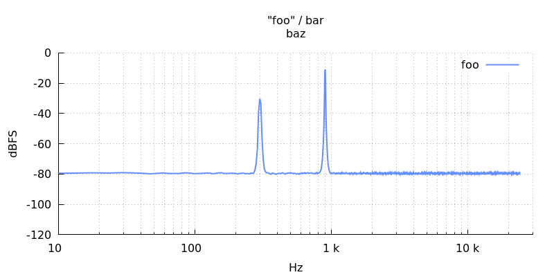

The drawback of enclosing with `'` is that then this character cannot
be used in the text. The only option is enclosing with `"`:

    ]$ plot_spectrum -i two_tones.txt --size small \
    -o quotes2.png --title "\\\"foo\\\" / 'bar'\nbaz" 2 foo

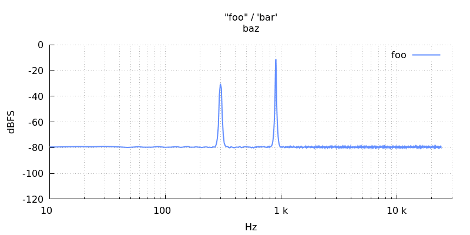

## Command substitution

gnuplot is using `` ` `` for command substitution:

    ]$ plot_spectrum -i two_tones.txt --size small \
    -o command_substitution.png --title '\`date +%T\` → `date +%T`' 2 foo

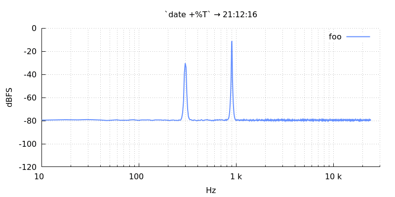

## Enhanced text

gnuplot's [enhanced
text](http://www.bersch.net/gnuplot-doc/enhanced-text-mode.html) is left
enabled. The characters with special meaning are: `~`, `@`, `^`, `&`, `_`, `{`
and `}`.  In order to remove the special meaning from those characters, they
need to be quoted with double `\`, for example:

    set title "foo\\@bar"

The usual quote removal, done by gnuplot for all texts, transforms `\\` to `\`
and then the enhanced text processor sees `\@` and removes the special meaning
from `@`.

    ]$ plot_spectrum -i dither.txt --size small \
    -o enhanced_text.png \
    2 'x\\^2 → x^2' \
    3 'x\\_0 → x_0' \
    4 'x\\@\\^2\\_0 → x@^2_0' \
    5 'X\\&\\{aaa\\}X → X&{aaa}X' \
    6 '\\~a/ → ~a/' \
    7 '\\{/Times bar\\} → {/Times bar}'

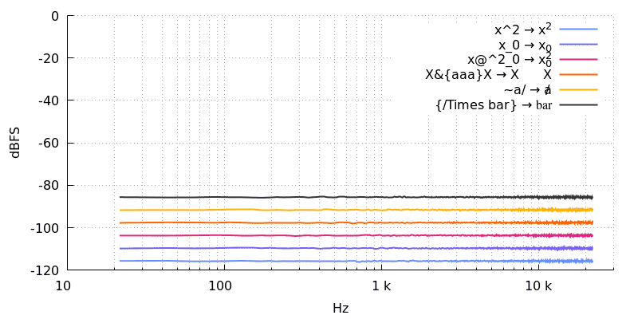

### Backslash

The consequence of the way gnuplot is processing enhanced text (or maybe it's a
[bug](https://sourceforge.net/p/gnuplot/bugs/1799/)) is that to display `\`
in a plain text, it needs to be quoted with `\`, so two `\` in total:

    ]$ plot_spectrum -i two_tones.txt --size small \
    -o backslash1.png \
    --title 'A backslash \\ without enhanced text' 2 foo

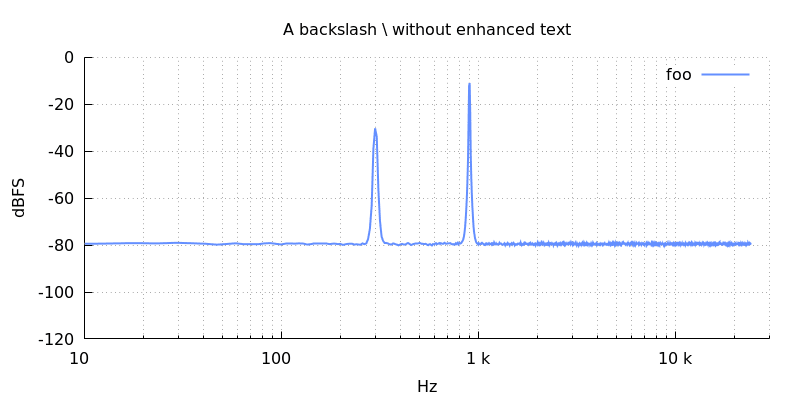

but to display it in the enhanced text, four `\` have to be used in total:

    ]$ plot_spectrum -i two_tones.txt --size small \
    -o backslash2.png \
    --title 'A backslash \\\\ with enhanced text (x^2)' 2 foo

